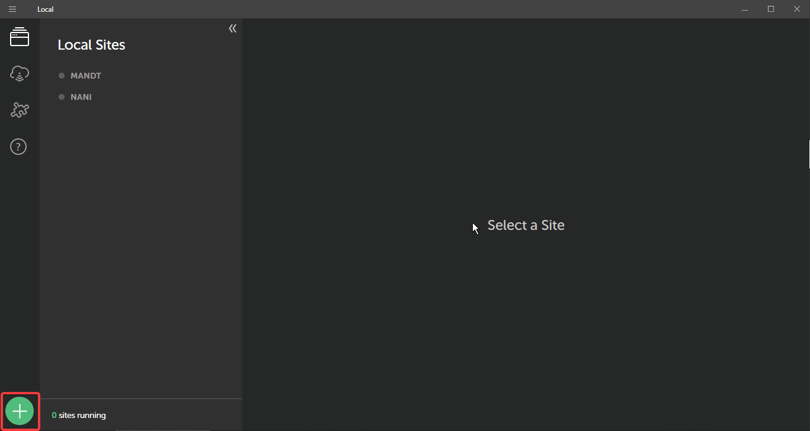
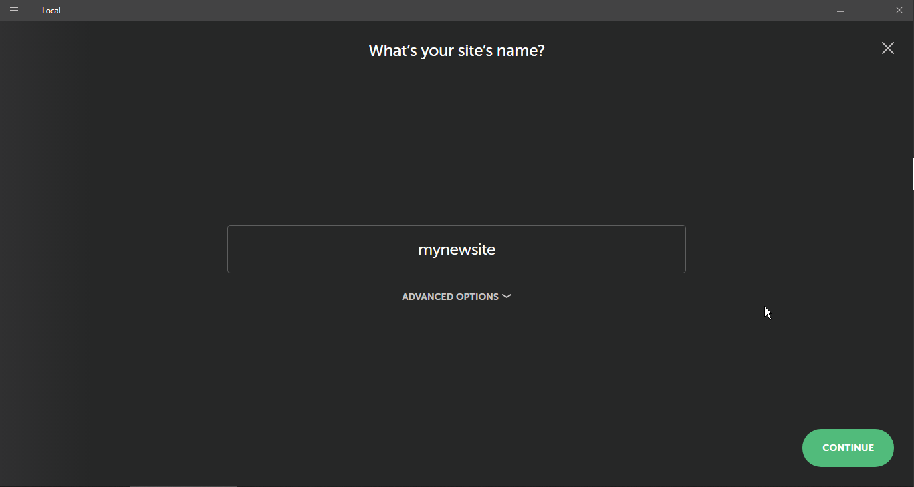
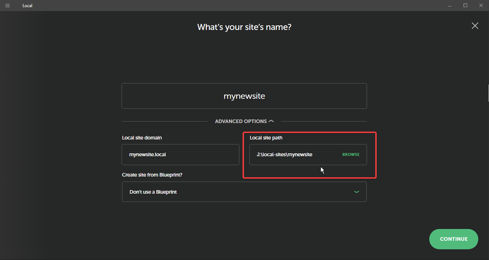
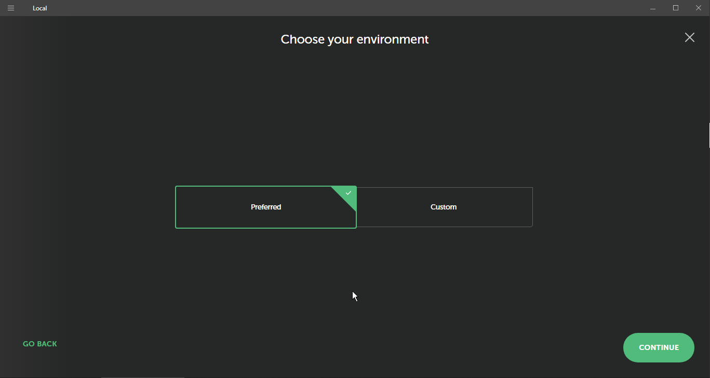
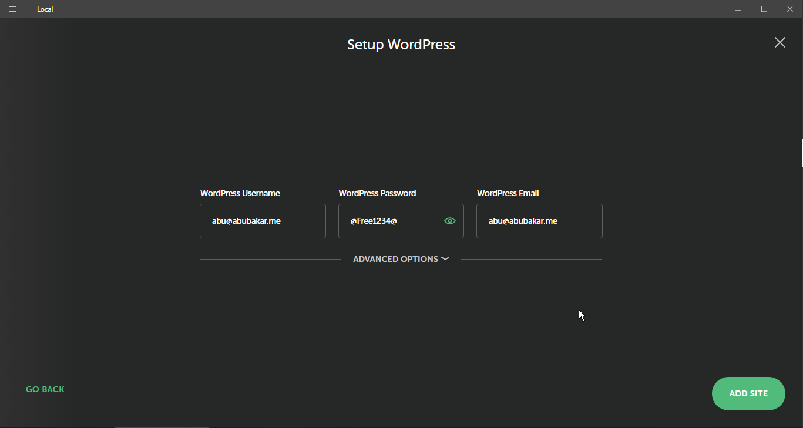
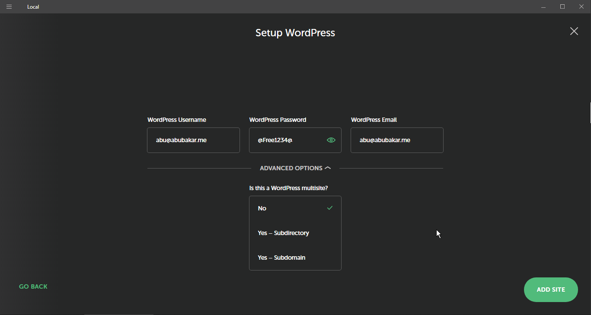
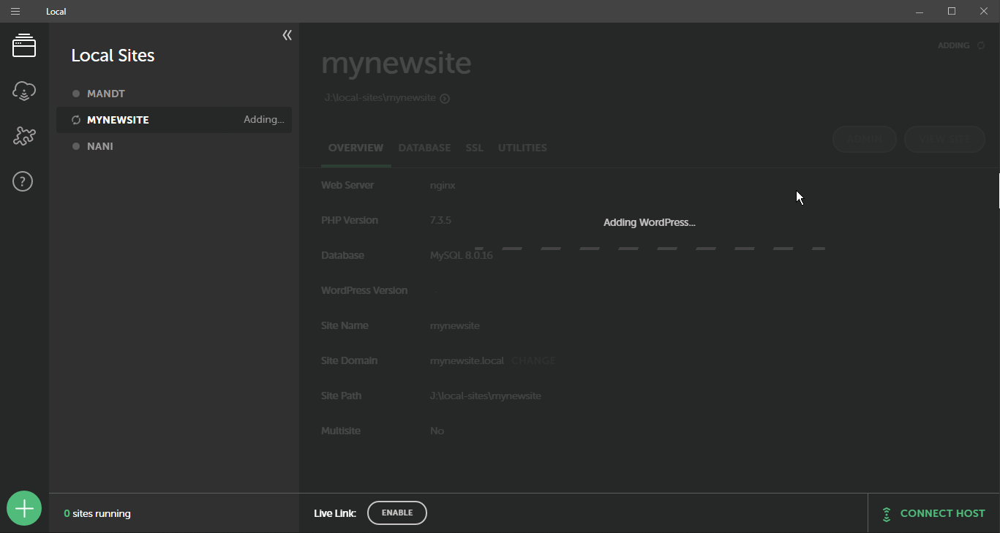

# Setting up local host for New Project

* [ ] Check if newer version of Local is available
* [ ] The open the Local and click on Plus icon bottom left. 
* [ ] Fill up the name field for you new site. 
* [ ] Make sure in "Advanced options" the "Local site path" doesn't contains any white spaces.
* [ ] click "Preferred" and continue. 
* [ ] Make sure the WordPress setup contains these values exactly. 
  * [ ] UserName:: abu@abubakar.me
  * [ ] Pass:: @Free1234@
  * [ ] Email:: abu@abubakar.me
* [ ] If your site is multisite then click "Advanced Options" and set Yes to multisite as per your needs.
* [ ] After that a user prompt will appear. click yes to add the site into Hosts file.
* [ ] Everything is done. Just wait for the setup to finalize. 