# Setup local for existing project

## First step - Making a Local site

Firstly you will need a Local site onto which you will replicate the live site by placing files and things of live site.[ Click here for that checklist](../01_setting_up_local_host\README.md)

## Second Step - Replicating live site to Local

- First goto your live site wp-admin page and click on Plugins=>Add new
- Then search for "wp file manager" and install the one by author "mndpsingh287" 
- Now click on "Wp file manager" to open it's page. 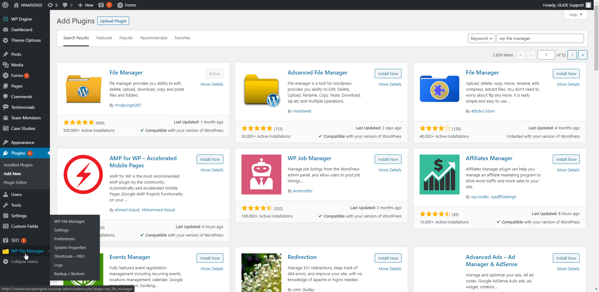
- Navigate to wp-content folder 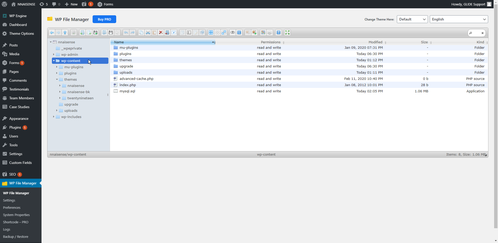
- Download these three folder by right click and download option.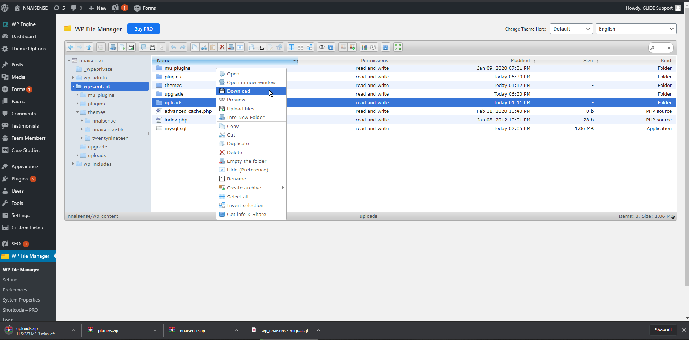
  - Plugins
  - Uploads
  - Themes/Project-Theme
- Open your Local and goto the site's respective folder for files and empty these folder. 
  - Plugins
  - Uploads
  - Themes/Project-Theme
- Go to current theme directory and extract the downloaded ZIP files into respective folders.
  - Plugins
  - Uploads
  - Theme
- Now go to your Local site's wp-admin
- Go to Add new plugin page.
- Search for "WP Migrate DB" by author "Delicious Brains" and install it. 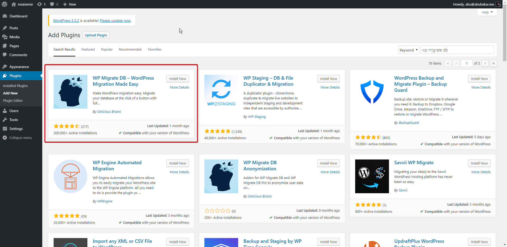
- Open you Local site=> Tools => Migrate DB and copy these two values. 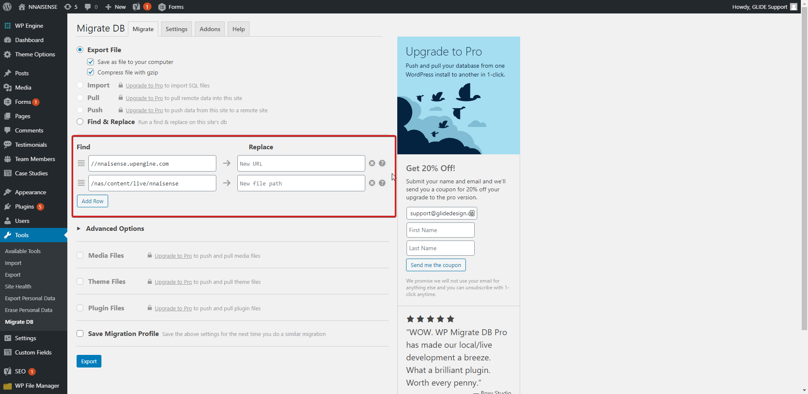
  - URL
  - File Path
- Go to live websites=>Tools=>Migrate DB 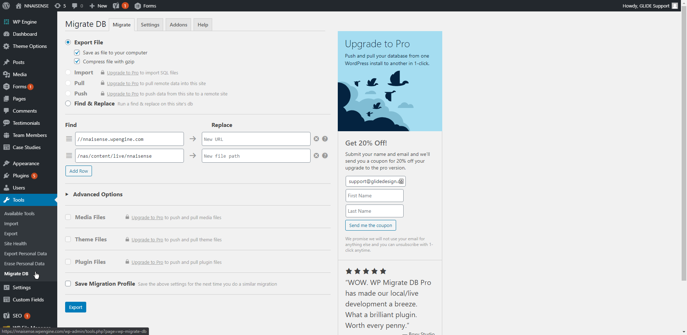
- Now paste the values you earlier copied, to these input fields respectively.
  - Url => Url
  - File Path => File Path
- Now uncheck these two checkboxes. 
  - Export File -> Compress file with gzip
  - Advanced Options ->  Replace GUIDs 
-  Click on Export button at bottom and wait for the SQL file to be downloaded. 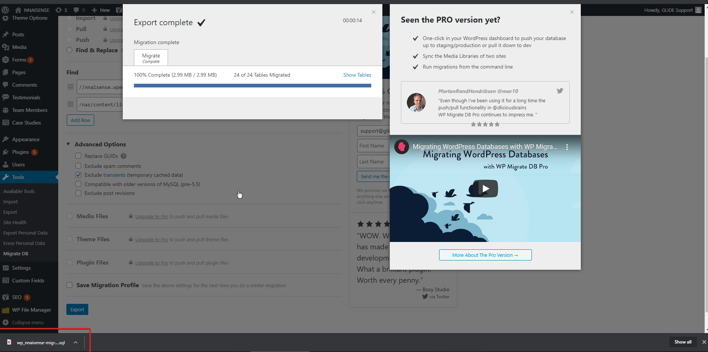
- Go to Local and click on Database tab on your site. Then click on "Open Adminer" to open your SQL database table.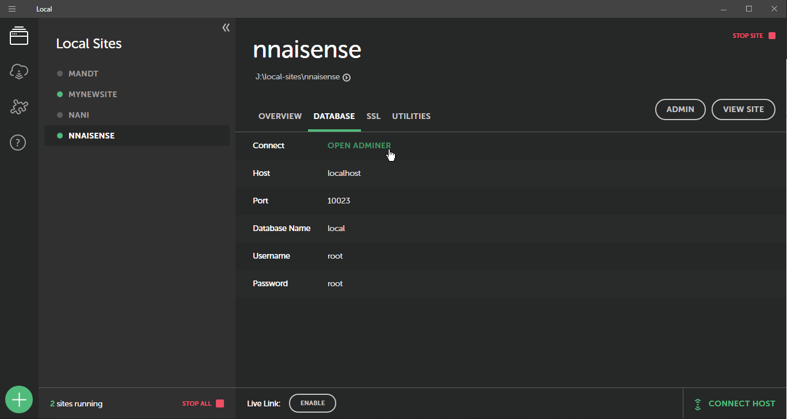
- If the page opens up normally then go ahead. If there is an error please [goto this link](#local-adminer-error) for further steps. Else follow the steps below.

## If the Local Adminer works fine Go Ahead with these setps

- Open the Local Adminer for that specific site by clicking on the site. Then starting the site. Then Database tab for that site and finally clicking on Open Adminer.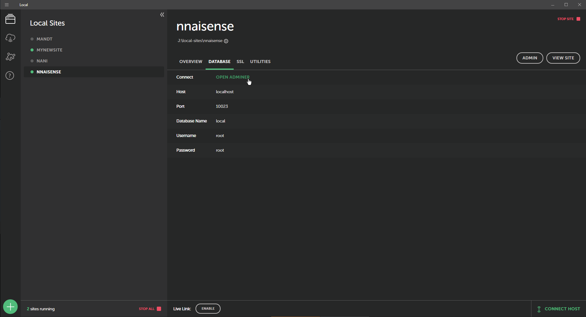
- The database for that site opens up. Click the checkbox that selects all tables. Now select "Drop Table" at bottom to drop the tables.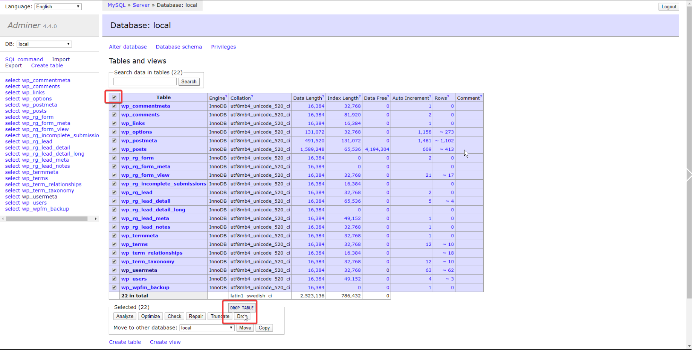
- Now click on import in left top sidebar.
- Click to upload the SQL file downloaded  [here](#sqldump-download) and click execute to import that SQL file into this database.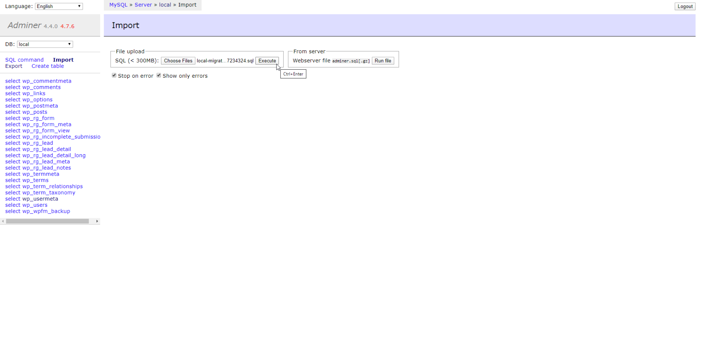
- Upon getting the confirmation message you are good to go [open the site](#local-open-site).

## Incase Local Adminer doesn't opens up correclty

- Use this process if you get an error like this.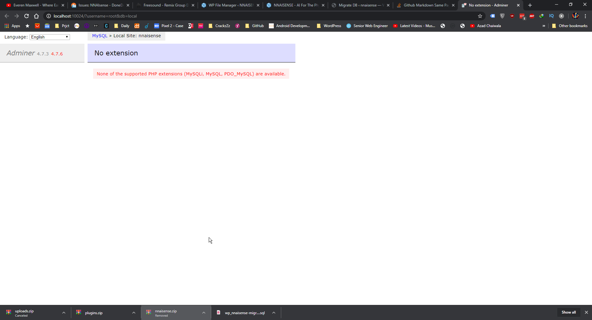
- If yes then continue else [go here](#local-adminer-fine).
- Install software named TablePlus 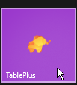
- Open the software
- Click on "Create a new connection" and select "MySQL". 
- Now fillup the opened window of TablePlus from respective values of Local Adminer values. Then test the connection. 
- By clicking on Connect and a new window will open up that will display all tables of the Local site.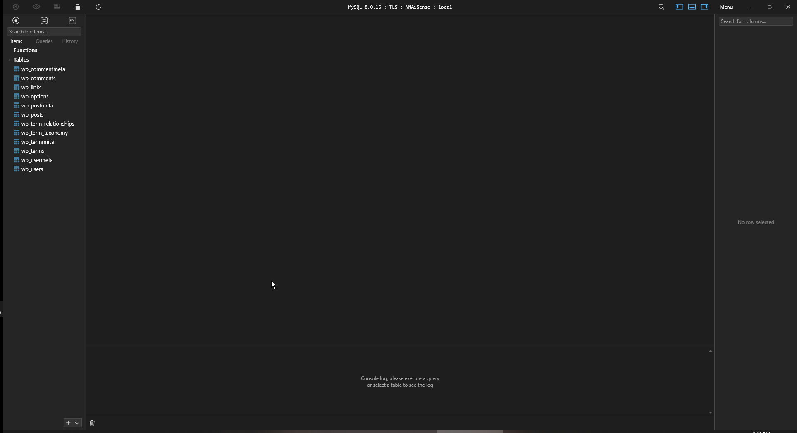
- Now select all tables. Then right click on them and select "Delete". Press OK to confirm. Now press "Ctrl + S" to save the changes to database. 
- Now right click in sidebar. Then select Import->From SQL Dump. Now select the file download early from live site [see above](#sqldump-download). Click on import to complete the process.

## The live site had been copied to Local site

- Just open up your Local and select the site. By clicking View site you will be able to see the site that is now replica of live site.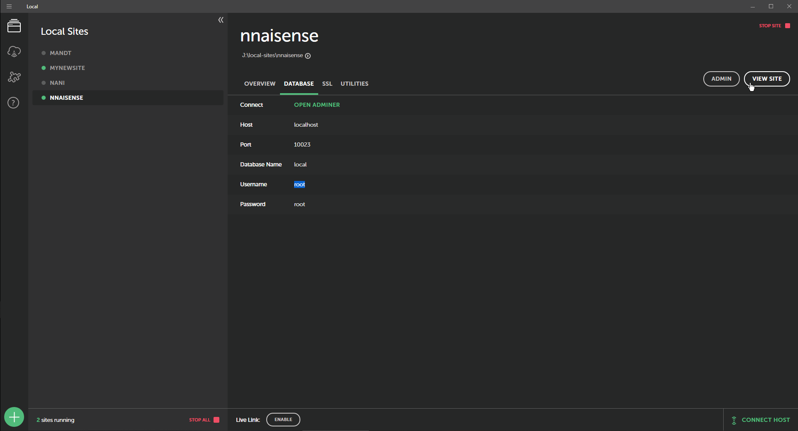