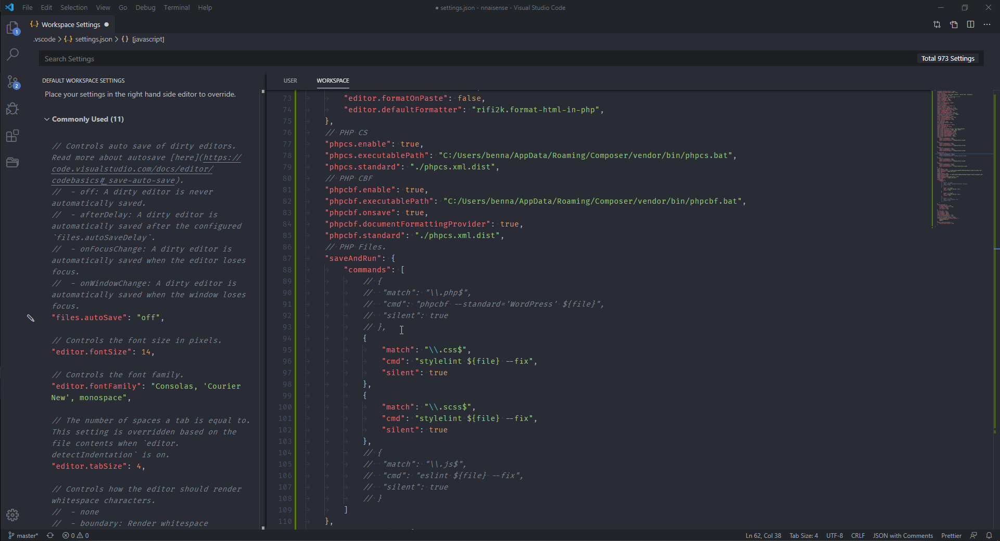

# VSCode Beautification

<code>Here is a little bit of demo what you will achieve after this checklist</code>

> ⚠️ ***Note*** This contains some processes to be done in a specific order. So follow the list given below

##  1. PHP Setup 🚧

### a. Installing PHP on Windows 🔧

* Go to *Google* and search for *php download* (Or  goto this link https://www.php.net/downloads.php)
* Select `Windows downloads`
* Select *Non Thread Safe* `Zip` file based on your system architecture *x86* | *x64* 
* Now goto *C* drive and make a new folder names `php`
* Extract the downloaded zip file into this folder.
* After that rename the file named `php.ini-development` &rightarrow; `php.ini`
* Now press windows button and search for `environment variables` and press *enter*. After that again click on `Environment Variables` button in the opened window.
* In `System variables` find `Path` variable and open it.
* Now click on *New* and enter the php folder path. That should usually be `C:\php` if you have not placed it somewhere else.
* Click `OK` then `OK` and again `OK` to close and save all windows.

## b. Check PHP Installation 🏁

* Press `Win+R` to open *Run* window.
* Type `cmd` to open the *Command line*.
* Type `php -v` and press enter. You should get the information of php version installed. 
* If you unfortunately get somethings like this `'php' is not recognized as an internal or external command operable program or batch file.`. Then please go through the [PHP installation setup](#php-installation-setup) again.

## 2. Composer

### a. Installing Composer

* Goto Google and search for composer (or go to this site https://getcomposer.org/)
* Click on Download button
* For Windows click on `Composer-Setup.exe` link to download EXE file. After downloading run the setup.
* The setup will find the installation of PHP in your PC. If it finds one it will provide the path to it confirming it has found. Else you need to [install PHP first](#php-installation-setup).
* For the option of updating `php.ini` file. Go ahead and do that.

> ⚠️ ***Note*** Don't enable `Developer Mode` during installation.

### b. Checking Composer Installation

* Press `Win+R` to open *Run* window.
* Type `cmd` to open the *Command line*.
* Type `composer` and press enter in CMD. You should get details of Composer. This means you have installed it properly. 

### c. Adding Composer Packages Globally

> Composer is a framework. To get work out of it you need to install that specific packages according to your needs. Here are some packages that you need to install for the current process.

* Press `Win+R` to open *Run* window.
* Type `cmd` to open the *Command line*.
* Now type these commands one by one to install these packages globally on the computer. You should get output like this confirming each installation.
  * PHP_CodeSniffer - `composer global require "squizlabs/php_codesniffer=*"`
  * WordPress Coding Standards - `composer global require "wp-coding-standards/wpcs=*"`
  * PHPCompatibility - `composer global require "phpcompatibility/phpcompatibility-wp=*"`
  * Code Sniffer Composer - `composer global require "dealerdirect/phpcodesniffer-composer-installer=*"`
* Now type command `phpcs -i` to get information related to PHPCS packages. You should get a list of installed standard for PHPCS like this including all of the above installed ones. 
* This confirms that the packages are installed correctly. We can move onto next step.

### d. Update Composer VSCode User Paths

> ***Note*** In this process you need to update paths of 2 `.bat` files in VSCode that are related to Composer &rightarrow; PHPCS

* Open VSCode and goto settings by pressing `Ctrl+,`
* You should see two types of *User* related settings. The settings below should be applied to both of these settings.
  * 1. User Settings
  * 2. Workspace settings
* Go to `phpcs.executablePath` and update it like this manner. `C:/Users/USERNAME/AppData/Roaming/Composer/vendor/bin/phpcs.bat` 
* You need to update the path of two paths as show in the picture above.
  * PHPCS
  * PHPCBF
* To confirm the paths are right, just copy the path and paste into new tab of *Chrome* and press enter.
* You should see some output like this *(instead of 404 Not Found Error)* confirming you have right path to that file.
* Do this for both `.bat` files path.
*

## 3. NodeJS

### a. Installation of NodeJS

* Go to *Google* and search for NodeJS (or goto this link https://nodejs.org/en/)
* Click to download `LTS` version of NodeJS.
* Open the setup and install as usual setup file.

### b. Checking NodeJS Installation

* Press `Win+R` to open *Run* window.
* Type `cmd` to open the *Command line*.
* Type `node -v` in CMD and press enter. You should see the installed version number of NodeJS. 

### c. Installing Modules of NodeJS

> NodeJS is a framework. To get work out of it you need to install that specific modules according to your needs. Here are some modules that you need to install for the current process.

* Press `Win+R` to open *Run* window.
* Type `cmd` to open the *Command line*.
* You need to install some modules globally by running the commands provided below.
  *  install ESLint globally - `npm i eslint -g`
  *  install StyleLint globally - `npm i stylelint -g`
  *  install Prettier globally - `npm i prettier -g`
*  After that run this command `npm list -g --depth 0` in same windows ro confirm all modules are installed correctly. If you see something like this you are good to go.  

## 4. Checking everything in VSCode

> ***Note*** You need to check that everything you installed, is properly integrated into VSCode as well. So we'll be running some commands we ran earlier in CMD, now in VSCode to check the output in that.

### a. Checking Workspace code.

* Open VSCode.
* Open VSCode settings by pressing `Ctrl+,`
* You should see two types of *User* related settings. The settings below should be applied to both of these settings.
  * 1. User Settings
  * 2. Workspace settings
* Here are some commands that you need to make sure are not commented out. Else these commands will not run and your beautification process will not work.
*  
*  
*  

### b. Checking installations in VSCode

* Open VSCode.
* If it is already open, make sure to `Reload window` through *Command Pallate*.
* Open *Terminal* by `Ctrl+t` or throught *Terminal &rightarrow; New Terminal*
* If you are asked to `-ExecutionPolicy Bypass` allow that. Because we have added that into *Workspace* settings.   
* To check the installation of everything here are the commands for each one seperately. Type the command and press enter to execute that.
  * For php type `php -v`
  * For composer type `composer`
  * For composer package PHPCS type `phpcs -i`
  * For NodeJS type `node -v`
  * For NodeJS Modules type `npm list -g --depth 0`
* If you got all the outputs right then find go ahead else go back to that specific setup and install again that specific setup to remove it's errors.

### c. Placing Beautification Files in Project

> ***Note*** For the beautifications processes to run, you need several files that contain some coding rules, that will be applied to your files according to file type. This process tell you how to add those files in your project so that you will not get such VSCode erros.

* Go to this repo Must [Have Project Files](https://github.com/webriverteam/Must-Have-Project-Files) and download this repo in `Zip` form. 
* Extract the zip folder.
* Copy all files from that folder and paste them into your current project *main* directory.
* If you already have some files, that will be replaced by this process, should be backed up. So if you decide to replace them. Make sure to update those files credentials according to current project. 
* After this process if you were getting some error before like this, those should be removed by now.   

## 5. Testing Beautification

> ***Note*** To check the beautification process you need to open up each type of supported files and try to save them. The commands will run on save and will beautify the code.

### a. Supported File Types

* HTML Files
* CSS / SCSS Files
* PHP Files
* JS Files

### b. Some Pointers

* You may get some notification like this depending on file size. If file size is smaller the notification may be not visible or visible for many less amount of time. 
* You can check the `Problems` panel to see the possible errors before and efter the `linting` or `beautification` process. 
* There are some errors that required human interaction, so those might be solved by the process.
