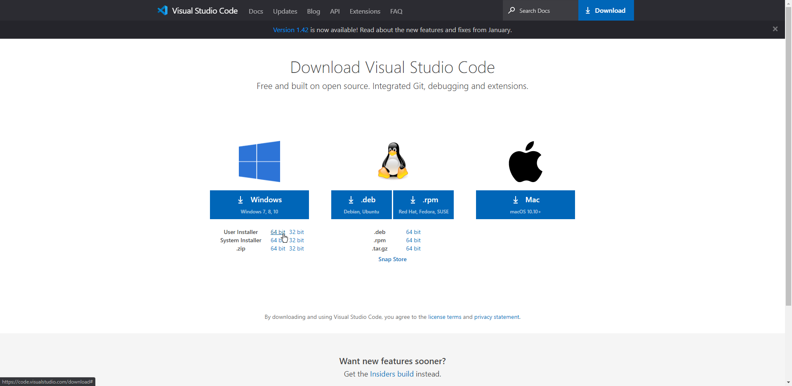
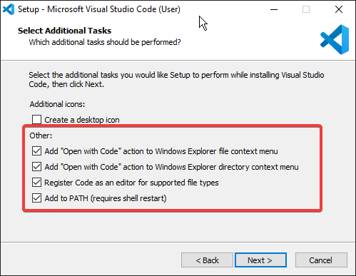
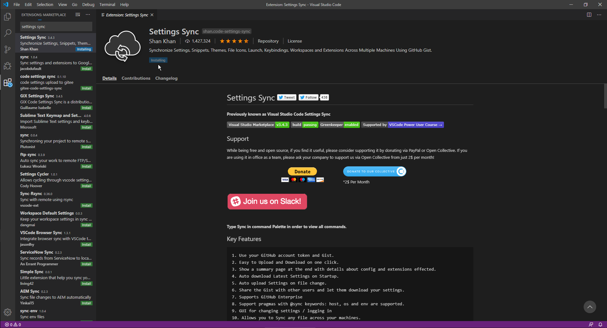
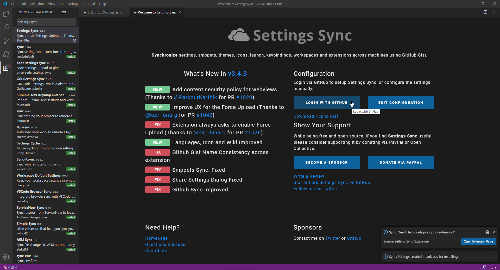
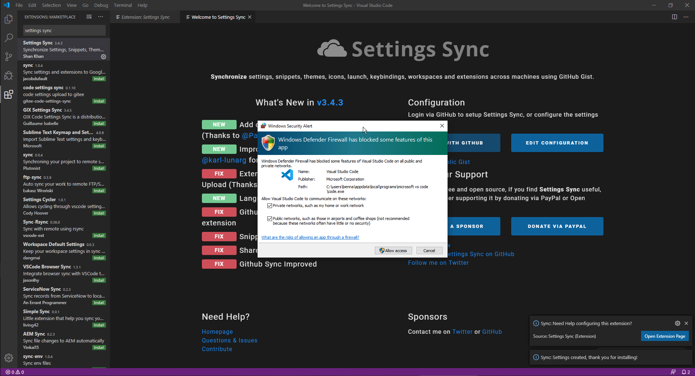
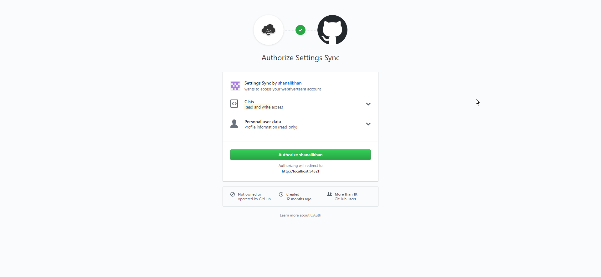
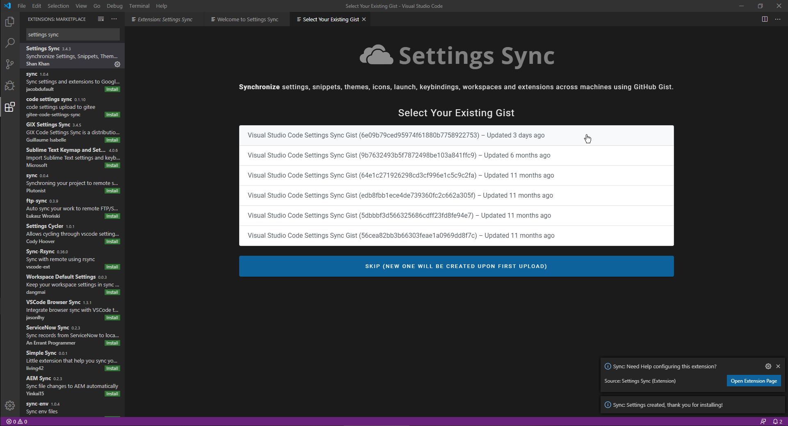
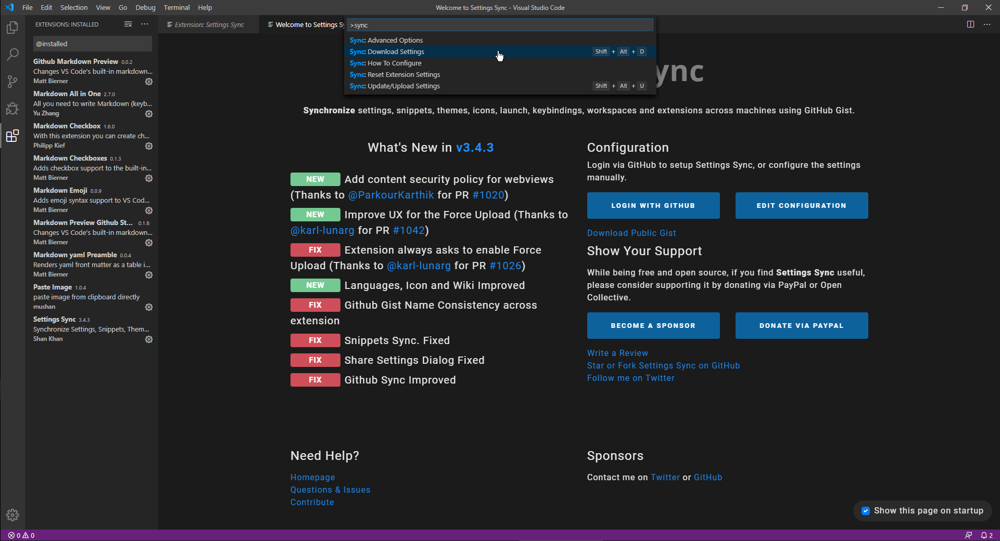
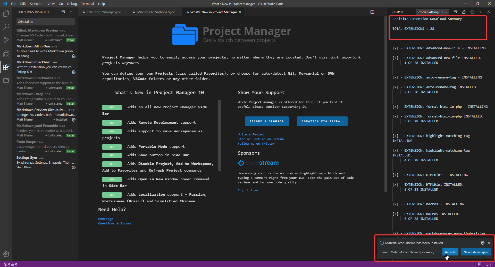
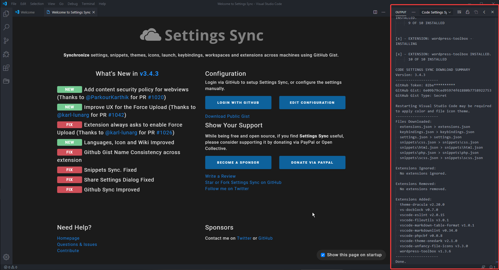

# Setting up VSCode

## Step one - VSCode Insallation

> ***Note*** In this step we will only install the VSCode. The installation of extensions, prettier, code formatter, user settings, workspace settings & any other thing will be done in the [second step](#vscode-resotre-backup).

- First Google search the VSCode OR you can go to this site. https://code.visualstudio.com/download
- I will select the "User Installer 64-Bit". Feel free to select the version according to your needs and system architecture.
- After that the setup will start downloading. Once it is done open the setup to start the installation.
- In the installation process check all boxes in the "Other" section like this. 
- After setup completes simply open the vscode from start menu or desktop icon.

## Second Step - Restoring backup of Settings / Extensions / Keybindings / Snippets

> This process restores theses files
> -  extensions.json
> -  keybindings.json
> -  keybindingsMac.json
> -  settings.json
> -  snippets
>       - css.json
>       - html.json
>       - php.json
>       - scss.json

	Make sure you have backed up these files if you don't want these to be overwritten.

## The process starts here

- Open up VSCode and navigate to extensions tab ( Command CTLR+SHIFT+X )
- Search for extension named `Settings Sync` by author `Shan Khan` and install it. 
- Then the default page for extension opens up. Click on `Login with Github` 
- If you are prompted with `Network Access` then allow it so that it can connect to internet. 
- If you have already logged into browser at Github.com then you will be asked to `Authorize` it. Simply do so to move forward.
- Else you will be asked to login to Github.com. Simply provide these credentials to login
  - Username :: `webriverteam`
  - Password :: `4eoO23g%1aqE`
- After sucessful login, the default extension page on VSCode will refresh and it will start displaying some backups it can find. Simply select the latest on from these. 
- You will be asked to close the tab to move forward with the process.
- After that type `CTRL+Shift+P` to open up command palette of VSCode and type `Sync` to filter the results with Settings sync extension options.
- Click on `Download Settings` option. 
- You will start to see `Realtime installations`. Feel free to activate somethings that get installed as per your requirements. 
- You may also need to setup some extensions as they get installed like `Project manager` in the above picture
- After the setup is completed you will get a success message like this. 
- Now press `CTRL+Shift+P` and type `reload` and select _reload window_
- All of your extensions, keybindings, snippets and settings has been restored. Enjoy using them.
