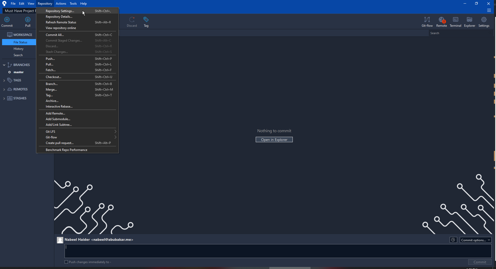

# Setting up Git repo for internal dev (Webriver's repo)

> 📝***Note*** This lecture explains the procedure of setting up a project to private repo of BitBucket.org on the account of team@webriver.co
> So the project remains totally inside webriver team only.

## Some Default Webriver's Repos

- [Must Have Project Files - BitBucket](https://bitbucket.org/abubakarteam/must-have-project-files-webriver/src/master/)
- [Must Have Project Files - Github](https://github.com/webriverteam/Must-Have-Project-Files)

## 1. Downloading required Softwares 🚧

- There are two softwares that are at best right now to be used with this process. Feel free to choose whichever you like.
  - [Bitbucket's Sourcetree](https://sourcetreeapp.com/)
  - [GitHub Desktop](https://desktop.github.com/)
- After downloading the setup simply install that to get going with this process.
- If you are required to login in either of the software here are the credetials.
- BitBucket's Sourcetree Logins
  - Username: team@abubakar.me
  - User: @Free1234@

## 2. Making Local Repo

### a. Making Git Repo of local folder using SourceTree 🏗

- Open the software. You will see the welcome screen.
- From there click on create and browse to the local computer folder where the WordPress theme residees. Also give it a proper name for refrence. 
- Only select `Git` as your version control system.
- Click on `Create` to make the local computer's folder into a git repo.
- If you are asked `The destination path already exists` message. Simply press `Yes` to move forward.
- After that `File Status` windows will open. On that window you will see all your files present in your theme. Check the files if there are any unncessary files like `node_modules` etc. 
- If such files are present please goto [this repo](https://bitbucket.org/abubakarteam/must-have-project-files-webriver/src/master/) and download `.gitignore` file and add it to your project.
- Make sure when you are downloading these kind of files, add necessary extensions to it. E.g. When downloading gitignore file it gets downloaded as Text file. So make sure to rename it to `.gitignore` when downloading. 
- After that all unnessary files should be removed from your Sourcetree file status tab.
- Now click on `Stage all` to stage the current files.
- If you have a very large file in your repo, ST will ask a confirmation that you want to add it or not. Make sure to remove such unnecassary files like theme backup zip, Photoshop design file or something like that before moving forward. 
- Now add a message so that everyone should know what this commit was about. Press `Commit` button to complete the process.
- Here you have it. The first commit was sucessfully added to your local computer's repo.

### b. Making Git Repo of local folder using GitHub Desktop 🏗

- After opening the software on your pc. Navigate to File -> New Repository (CTRL+N)
- In the opened popup window, fill out all required fields, specifically the list below. 
  - Repo name &#8594; Your custom name you want to give it.
  - Description &#8594; Details related to your repo.
  - Local Path &#8594; Path where the local WordPress theme resides.
  - Initialize README.md &#8594; Don't need to check this box
  - Git Ignore &#8594; Don't need to select any from this
  - Liscence &#8594; Don't need to select any from this
- Click on create repository to move forward.

## 3. Connecting Local Repo to Live Repo

> ***Note*** After making the local repo, you need to replicate it to a live source as a backup. In this process i will guide you how to move your local repo to a online account such as BitBucket.org & GitHub.com

### a. Live BitBucket Repo

- Go to [BitBucket.org](https://bitbucket.org/) and click login button. If asked for credentials please [use these](#bb-login-credentials).
- After successful login, you'll be redirected to Dashboard.
- On the far left sidebar you'll see a Plus icon, click it and then choose Repository to make a new repo on this account.

 
- You'll be asked for basic information just provide the Repo name, then make it private make sure you have it on Git. Click Create to make an empty new repo.
- After that make sure to change SSH to HTTPS and then copy the link for that repo. 

### b.Connecting Live repo to Sourcetree Local Repo

- Open your Sourectree and open the repo you want to connect to live repo. 
- Now go to Repository &rightarrow; Repository Settings (CTRL+Shift+,)
- Now click on Add.
- After that give the remote source a name like i gave `BitBucket` here so that i can remember it.
- Provide the repo link you copied [earlier here](#bb-repo-codecopy). Make sure to remove `git clone` before that.
- From dropdown select your appropriate account and then click ok to continue. 
- Now click on `Push` button in the top bar.
- Select the branches you want to push to live repo and click push.
- After that you will get a success message confirming all of your data has been placed on live repo.
- You can confirm this by going to the repo and it should now contains your files like this one.
