# Setting up project from blank theme (Front-End)

> ***Note*** For those who want to start a project from scratch for HTML/CSS purposes.

> ***Note*** At Webriver we want the project to be fully managed from the start. So when you need help of any fellow worker on this or someone else starts working on this as back-end then he should not have any problem about the setup because everything is managed from start. That's why we will go throught all the necessary setups required to manage the project from this point.

## 1. Setup a Local site on your pc

This is required so that you can fully use the Gulp procedures made for WordPress on this project such as SCSS, Image optimization, CSS & JS files combining and much more.

So for this process you need to follow [this checklist](../../01_localhost_setup/01_a_setting_up_local_host_new_project/README.md).

After you have completed making a Local site setup we'll move forward now.

## 2. Adding blank WordPress theme

* Go to this link to find the default [Webriver blank theme](https://github.com/Webriver-Team/Webriver-Base-WordPress-Theme).
* Download that using github download function and extract that into your `wp-content/themes` folder. 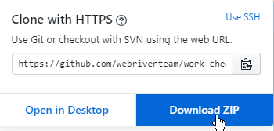
* Rename the `new blank theme` folder name with your `project name` 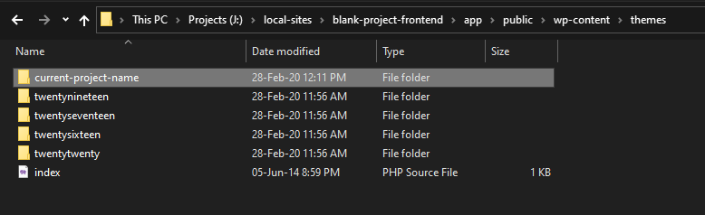

## 3. Updating Project Details in Basic Files

> ***Note*** There are some files that need to be updated according to current project. That contains the informatoin about the project like it's name, author, version etc. So that when a file runs it should reflect the naming scheme of current project than the blank project.

> For this process navigate to current project theme directory and open the files asked below to edit and then make appropriate changes to them.

### a. WPGulpConfig.js File

* Change project name
* Change project URL   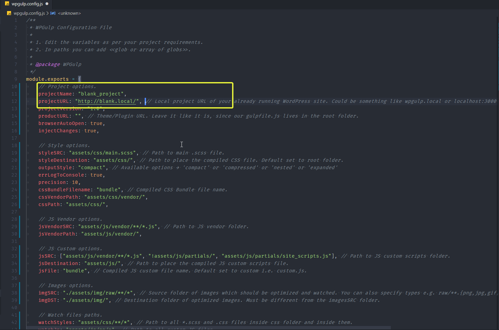

### b. Style.css File

* Change `Theme Name`
* Change `Theme URI` - This is domain link of official site of this project.
* Make sure `Author Name` is `Glide Design`
* Make sure `Author website` is `https://www.glidedesign.com/`
* Update `Project Description`
  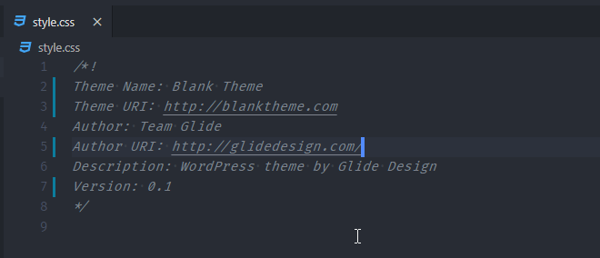

### c. composer.json File

* Update `Name` in this manner `glidedesign/project-name` in small caps
* Update `Project Description`
  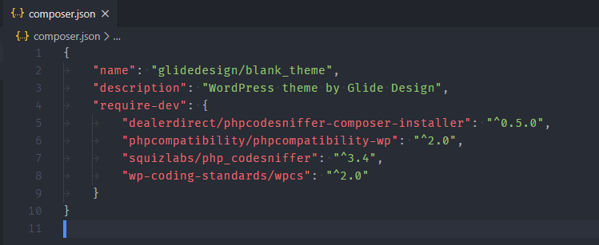

### d. Readme.txt File

* Change `Contributors`
* Update `Tags`
* Update `Tested up to` with current WordPress version.
* Update `Project Description`
* Update `Changelog` add date of initial release
  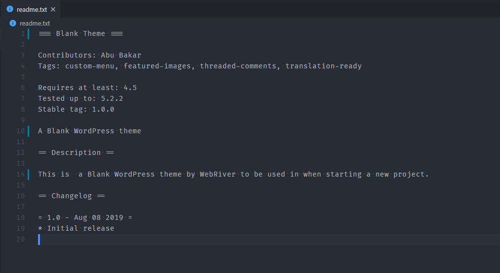

### e. package.json File

* Change `project name` with only small caps
* Update `Project Description`
* Make sure `Author Name` is `Glide Design`
* Make sure `Author website` is `https://www.glidedesign.com/`
  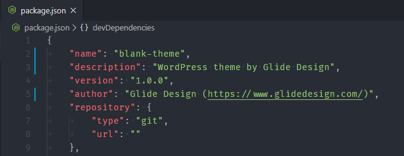

### f. Screenshot.png File

* Update project screenshot with project logo.

### g. Favicon.ico File

* Update project favicon with project logo or given file.

### h. phpcs.xml.dist file update

* Chnage text domain for the project   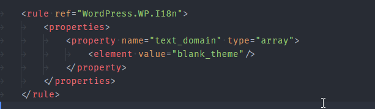
* Change theme variable name prefix   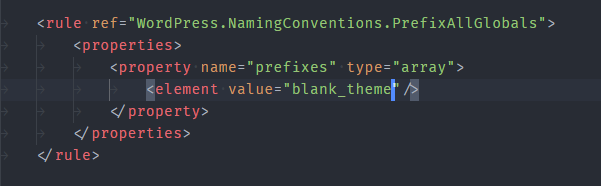

## 4. Removing extra files

> ***Note*** Most probably only required files will be present in these folders. But you need to recheck these folder according to project needs and remove any unnecassary files if needed to be. In the screenshots below the images highlighted are the ones to be deleted.

* Main Theme Directory 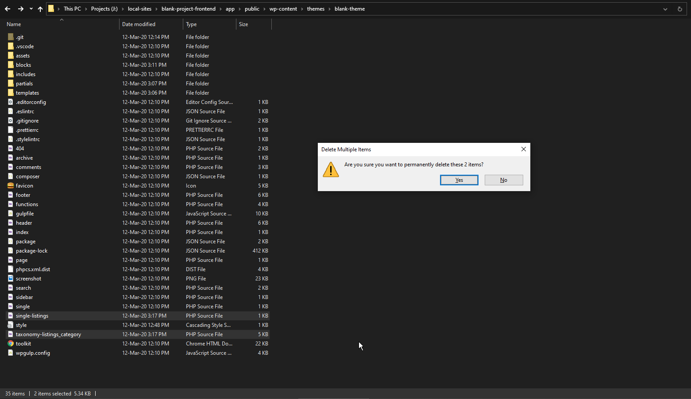
* Templates  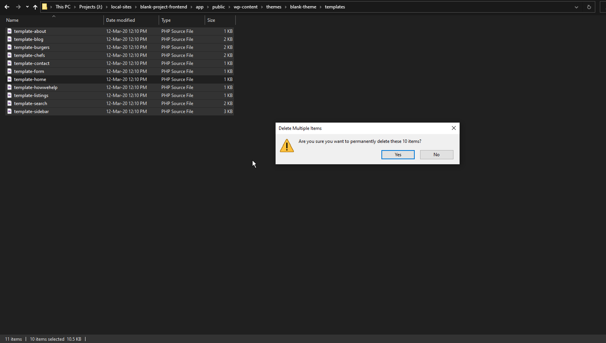
* Partials 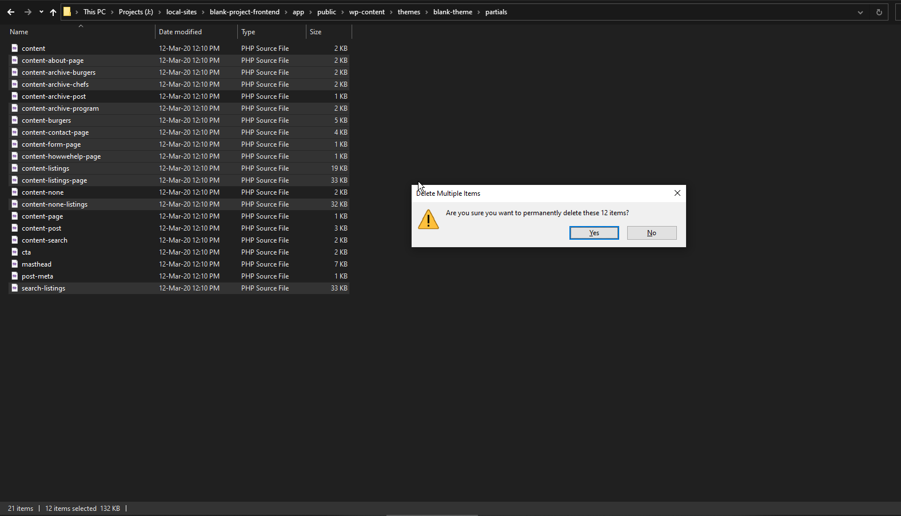
* Blocks 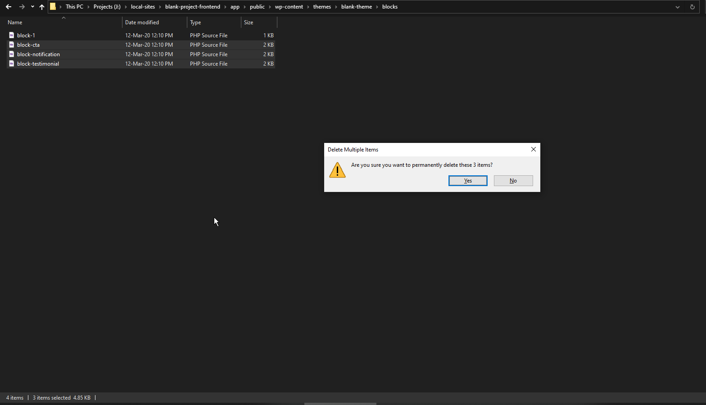
* Assets/Css/Vendor 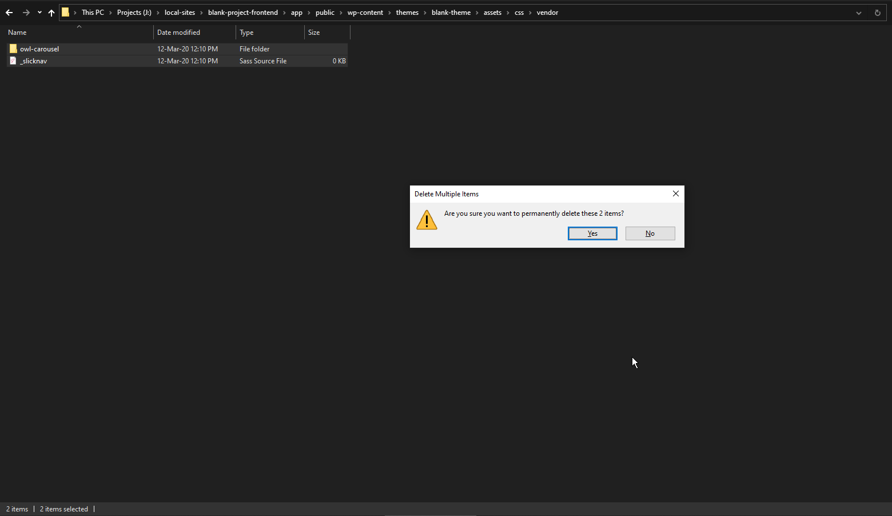
* Assets/Css/Site 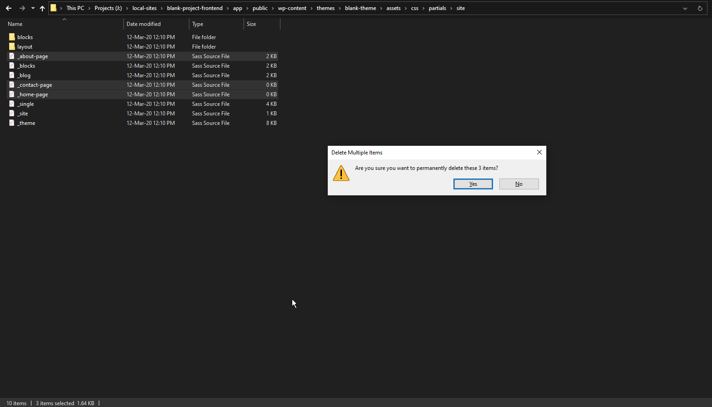
* Assets/Css/Site/Blocks 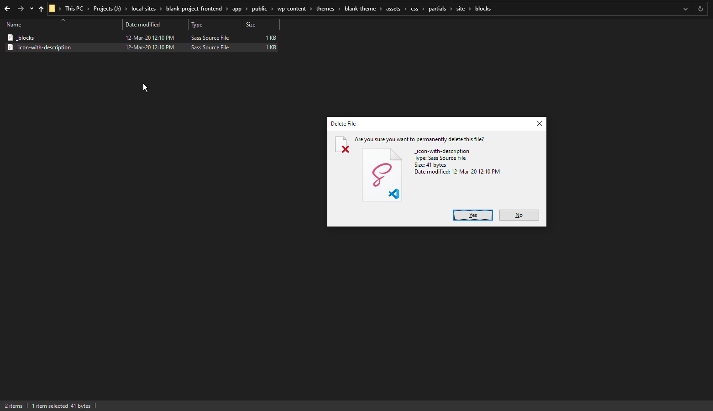
* Assets/Js/Vendor 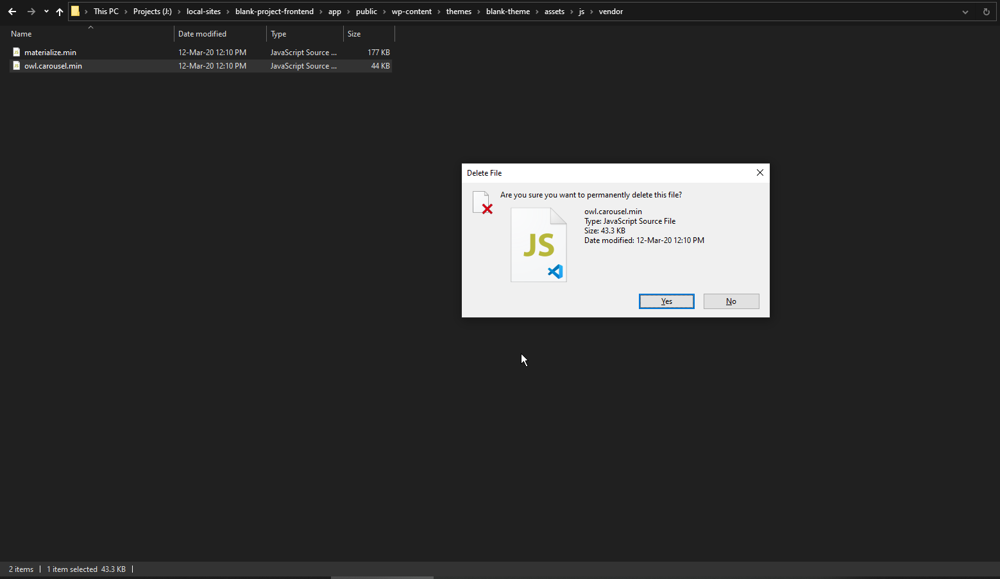
* Assets/Fonts 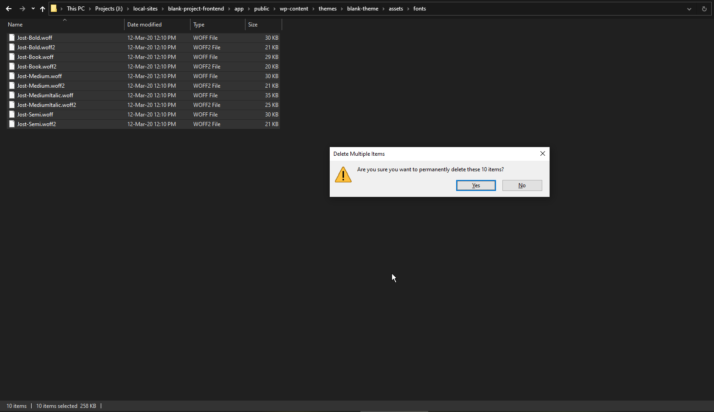
* Assets/Img 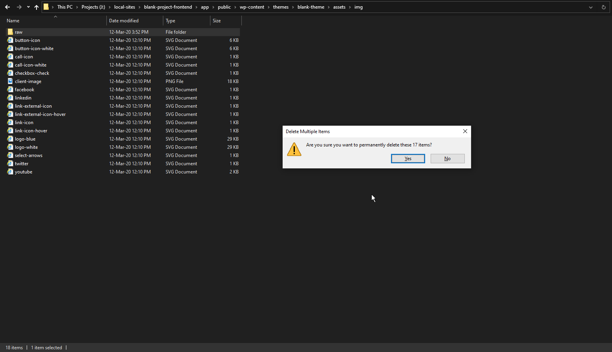

## 5. Gulp for WordPress

### a. Installation of NPM project based

* Make sure you have these files present in project
  * Gulpfile.js
  * package.json
  * wpgulp.config.json
* Make sure you deleted the package-lock.json file.
* After that run this command in terminal. `npm install` This command will install all required modules for the project listed in package.json file and also will create the package-lock.json file for the project.
* If you get around 30 vul then it is ok. These are due to some dependecies on modules. Your process can run normally. 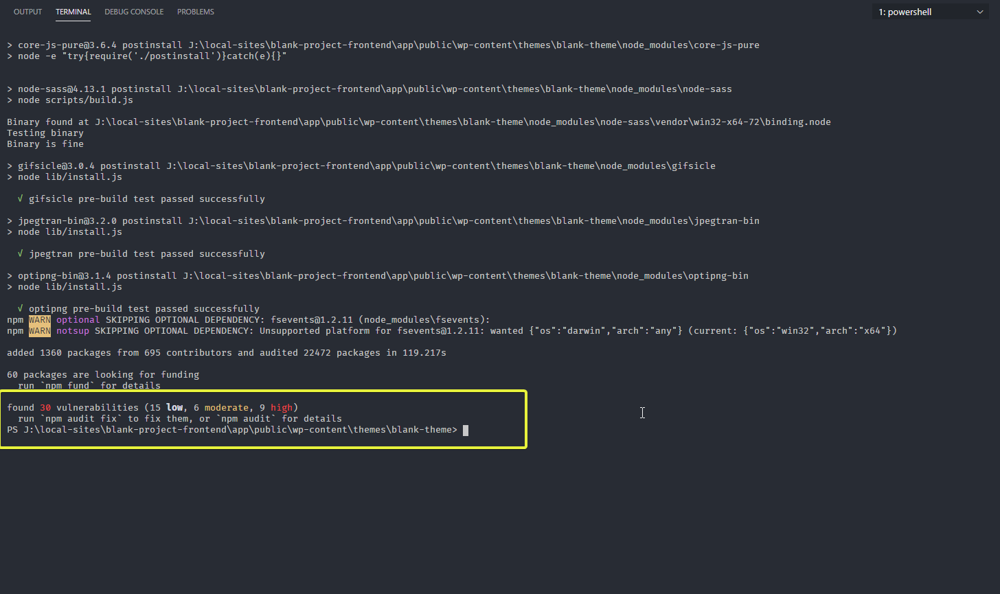

### b. Running Gulp for project

* Open the terminal
* Enter this command `npm start`
* The gulp processes will start to run and do the following process for first time. If all of these go fine then then you are good to go.
  * Styles
  * Scripts
  * Images
* Make sure the bundle files are  genereated for
  * CSS as bundle.css / bundle.min.css
  * Js as bundle.js / bundle.min.js

## 6. Adding HTML files

* Create a html file in main directiry with index.html name.
* Open that and add default HTML tag. That includes Header, Body & Footer tags
* Include the bundle.js  file and bundle.css file that are generated by wordpress gulp process.
* Start working on your HTML.
* You can setup live preview of HTML files on this link `http://localhost:3000/wp-content/themes/your-theme-name/index.html`

## 7. Bitbucket integration

> ***Note*** The above setup make you start working on the Front-End of projcet. But if you want that some people should collaborate or you want someone to work on Back-End of project, then you need to upload this to a online repository so that people should download it from there and start working on thier end.

* This process is already covered in an early checklist. You can refer to that [here](../../04_settingup_webriver_git_repo/README.md)
