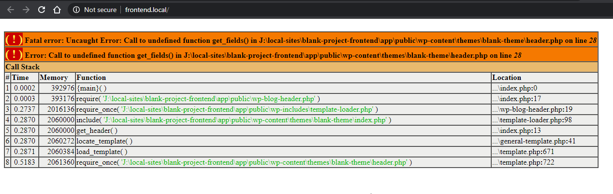

# Setting up project from blank theme (Back-End)

> ***Note*** For those who want to start a project from scratch for Custom WordPress Theme purposes.

> ***Note*** At Webriver the project has been fully managed from start. So the person who created this repo already should have done all of the required things already that can be seen in [this checklist](../06_a_setup_project_from_blank_frontend/README.md). So if you see something not in proper order make those things right.

## 1. Setup a Local site on your pc

This is required so that you can fully use the Gulp procedures made for WordPress on this project such as SCSS, Image optimization, CSS & JS files combining and much more.

So for this process you need to follow [this checklist](../../01_localhost_setup/01_a_setting_up_local_host_new_project/README.md).

After you have completed making a Local site setup we'll move forward now.

## 2. Clone Live Repository

The person who started working on this as front-end developer, must have a setup of this at bitbucket account. You need to clone that repo and make a branch from it so that you can work on it.

## 3. Adding Plugins

> ***Note*** There are some plugins that are MUST required for base theme to work. Because it has some integrations with those to work with.
> For example `Theme Options` are dependant on Advanced Custom Fields (ACF) plugin and so on.
> Else you are going to get some errors like this 

### a.  Plugins Required

* ACF
  * ACF Gravity Form
  * ACF Nav Menu
* Gravity From
* Section Container
* Safe SVG

## 4. Site Plan

* You need to find the `Site Plan` for you current project, mostly can be found in Google Drive.
  * User: team@abubakar.me
  * Pass: @@@free1234@@@
* Read that file and plan all of these
  * Templates
  * Blocks
  * CPTs

## 5. Comments on Invision / Figma

You need to check the invisoin and Figma for comments. This is must there will be some comments for developer that can be like

* How animations will work
* Read More functionality
* Slug or permalink related notes
* Maybe add extra link in breadcrumb on somepages

These are just a few exaples you can get many things from these files that are very very necassary in the process of WordPress theme making.
