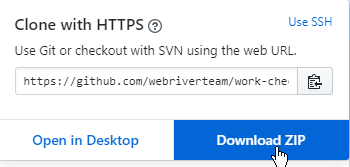
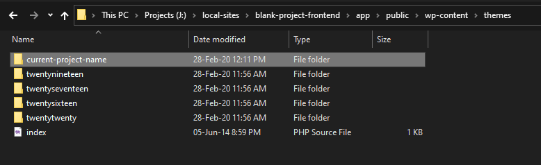

# Setting up project from blank theme (Front-End)

> ***Note*** For those who want to start a project from scratch for HTML/CSS purposes.

> ***Note*** At Webriver we want the project to be fully managed from the start. So when you need help of any fellow worker on this or someone else starts working on this as back-end then he should not have any problem about the setup because everything is manager from start. That's why we will go throught all the necessary setups required to manage the project from this point.

## 1. Setup a Local site on your pc

This is required so that you can fully use the Gulp procedures made for WordPress on this project such as SCSS, Image optimization, CSS & JS files combining and much more.

So for this process you need to follow [this checklist](../01_setting_up_local_host/README.md).

After you have completed making a Local site setup we'll move forward now.

## 2. Adding blank WordPress theme

* Go to this link to find the default Webriver blank theme.
* Download that using github download function and extract that into your `wp-content/themes` folder. 
* Rename the `new blank theme` folder name with your `project name` 
*
